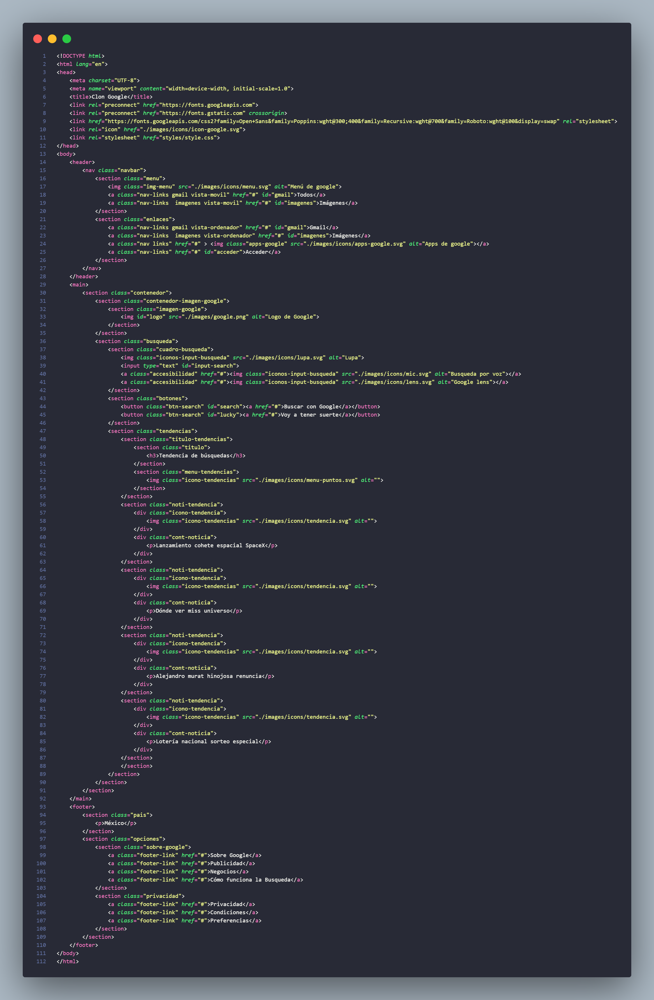
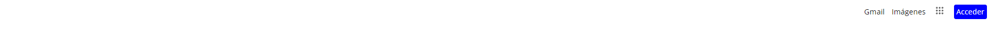
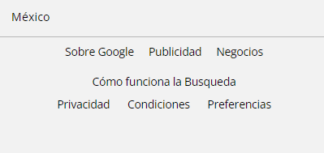
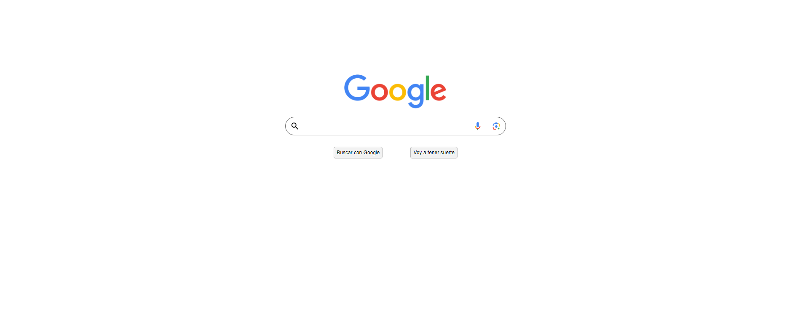
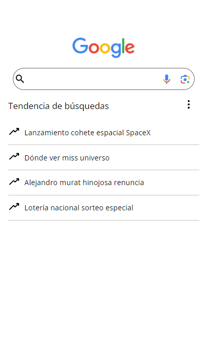
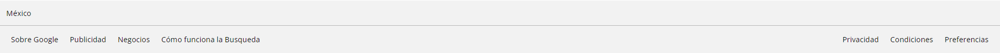

### Clon de Google

Este proyecto es un clon simple de la página de inicio de Google. La estructura HTML y los elementos visuales se han replicado con fines educativos y de práctica. No poseo derecho sobre logos e imagenes.

## Contenido

1. [Estructura del Proyecto](#estructura-del-proyecto)
2. [Barra de Navegación](#barra-de-navegación)
3. [Contenido Principal](#contenido-principal)
4. [Pie de Página](#pie-de-página)

## Estructura del proyecto

El código HTML sigue una estructura básica con secciones para el encabezado, el contenido principal y el pie de página. También se incluyen enlaces a fuentes externas y hojas de estilo.

<!-- Código HTML completo aquí -->

## Barra de navegación

La barra de navegación contiene enlaces a diferentes servicios de Google (ningun enlace redireciona a ninguna página externa o hacia alguna parte del documento), así como opciones para acceder y mostrar el menú. Se adapta a diferentes tamaños de pantalla con enlaces específicos para dispositivos móviles y de escritorio.

- Barra de navegación, vista de escritorio

- Barra de navegación, vista móvil

## Contenido Principal 

El contenido principal consta de la sección de la imagen de Google, el cuadro de búsqueda y las tendencias de búsqueda(las tendencias de búsqueda están ocultas en la vista de escritorio). La sección de tendencias incluye noticias populares en un diseño sencillo.

- Contenido principal vista de escritorio

- Contenido principal vista de móvil

## Pie de página

El pie de página contiene información sobre el país y enlaces adicionales sobre Google, así como opciones de privacidad.

- footer vista de escritorio

- footer vista móvil

## Contribuciones

Siéntete libre de contribuir, realizar mejoras o informar problemas. ¡Disfruta explorando el clon de Google! 😊.